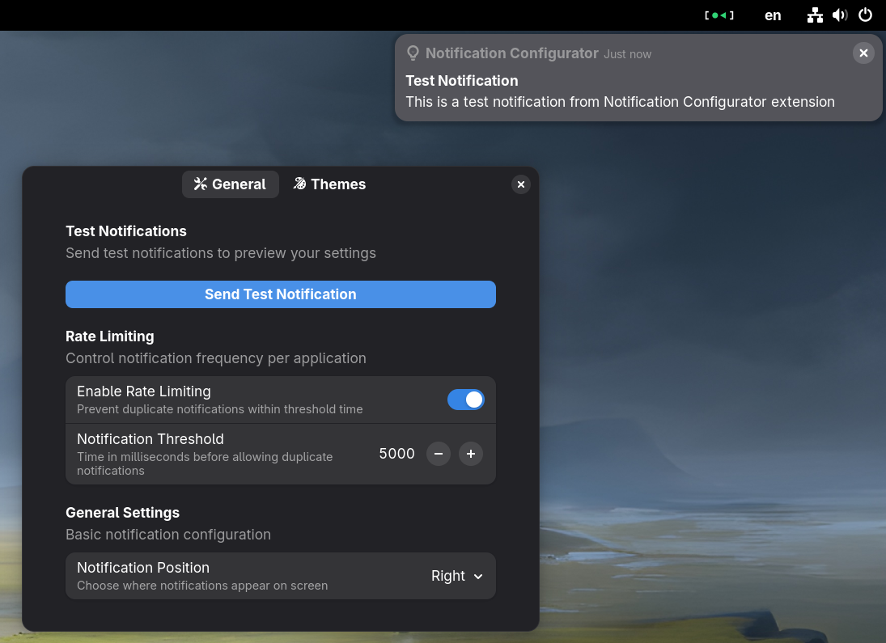

<h1 align="center">
	<br>
  GNOME Notification Configurator<br>
  
</h1>
<p align="center"><strong>Advanced GNOME notification capabilities including rate limiting, custom color theming per application, and notification positioning</strong></p>

<div align="center">

  [](https://t.me/ExposedCatDev)
  [](https://www.reddit.com/user/ExposedCatDev)
</div>

<br>

## Features

- **Notification Rate Limiting** - Prevent frequent notifications from the same app within a configurable time threshold
- **Notification Filtering** - Block or hide unwanted notifications using regular expressions to match title, body text, or application name
- **Custom Color Themes** - Set custom colors for notifications per application using app names or RegExp patterns (background, title, body, app name, time)
- **Notification Positioning** - Control where notifications appear on screen (fill, left, center, right)
- **Fullscreen Notifications** - Enable or disable notifications when applications are running in fullscreen mode
- **Test Notifications** - Send test notifications to preview your settings instantly
- **Real-time Configuration** - Changes take effect immediately without requiring restarts

## Installation

### Extension Manager (Recommended)
- Install [Extension Manager](https://flathub.org/apps/com.mattjakeman.ExtensionManager)
- Search For `Notification Configurator` in `Browse` tab
- Select the extension and click `Install`

### GNOME Extenssions Website
<a href="https://extensions.gnome.org/extension/8249/notification-configurator/">
  <!-- Button SVG by Just Perfection developer -->
  
</a>

### Manual Installation

Since this extension is not yet available on the GNOME Extensions website, you can install it manually:

1. Clone this repository:
   ```bash
   git clone https://github.com/ExposedCat/gnome-notification-configurator.git
   cd gnome-notification-configurator
   ```

2. Install dependencies:
   ```bash
   npm install
   ```

3. Install the extension:
   ```bash
   npm run inject
   ```

   This will build the extension and install it to your local GNOME Shell extensions directory (`~/.local/share/gnome-shell/extensions/`).

4. Restart GNOME Shell:
   - Log out and log back in

5. Enable the extension:
   ```bash
   gnome-extensions enable notification-configurator@exposedcat
   ```

   Or use GNOME Extensions app to enable "Notification Configurator".

### Requirements

- GNOME Shell 47 or 48
- npm

## Development

### Development Workflow

1. **Setup development environment:**
   ```bash
   npm install
   ```

2. **Start development session:**
   ```bash
   npm start
   ```
   This will:
   - Compile TypeScript sources
   - Copy metadata, schemas, and styles
   - Install to extensions directory
   - Launch nested GNOME Shell session for testing

3. **Debug the extension:**
   - Check terminal output for logs in the nested shell session
   - Access Looking Glass debugger with `Alt+F2` → `lg` for interactive debugging

### Architecture Overview

This extension consists of three main components:

1. **NotificationsManager** - Handles notification filtering and rate limiting by patching the `FdoNotificationDaemonSource.prototype.processNotification` method
2. **ThemesManager** - Applies custom colors to notifications by monitoring the message tray and dynamically styling notification elements
3. **SettingsManager** - Manages GSettings integration and provides reactive updates when settings change

### How It Works

#### Notification Processing
The extension patches GNOME Shell's notification processing system with a two-stage filtering process:

1. **Notification Filtering** - First stage that blocks unwanted notifications:
   - Intercepts notifications via `FdoNotificationDaemonSource.prototype.processNotification`
   - Matches notifications against user-defined RegExp filters based on title, body text, or app name
   - Supports regular expression patterns (case-insensitive) with empty fields ignored
   - Examples: `^Error` (starts with Error), `update|upgrade` (contains either word), `\d+` (contains numbers)
   - Destroys notifications that match any active filter
   - Configurable action per filter: hide (acknowledge) or destroy notifications
   - Invalid regex patterns are ignored and logged as warnings

2. **Rate Limiting** - Second stage for duplicate notification prevention:
   - Tracks timing of notifications per source application (only for non-filtered notifications)
   - Blocks duplicate notifications within the configured threshold (default: 5 seconds)
   - Sets `notification.acknowledged = true` to prevent display of rate-limited notifications

#### Notification Positioning
The positioning system allows you to control where notifications appear on screen:
- Sets the `bannerAlignment` property of the message tray
- Supports four positions: Fill Screen, Left, Center (default), and Right
- Uses Clutter alignment constants for consistent positioning
- Changes take effect immediately without requiring extension restart

#### Fullscreen Notifications
The fullscreen notification system provides control over notification behavior when applications are in fullscreen mode:
- Patches the `MessageTray._updateState` method to override fullscreen detection
- Temporarily modifies the `Monitor.inFullscreen` property during notification processing
- Allows notifications to be displayed even when apps are running fullscreen (games, videos, presentations)
- Configurable toggle to enable/disable this behavior per user preference
- Restores original fullscreen behavior when the feature is disabled

#### Custom Theming
The theming system works by:
- Monitoring the message tray container for new notifications using the `child-added` signal
- Parsing the notification DOM structure to find text elements (app name, time, title, body)
- Applying custom CSS styles based on configured color themes per application
- Matching applications using RegExp patterns (with fallback to partial string matching for backward compatibility)
- Examples: `^Firefox` (starts with Firefox), `Chrome|Chromium` (either browser), `.*Code$` (ends with Code)

#### Settings Integration
- Uses GSettings schema: `org.gnome.shell.extensions.notification-configurator`
- Provides reactive updates through a custom event emitter system
- Stores app-specific themes as JSON in GSettings
- Supports toggling features without requiring extension restart

### Available Scripts

- `npm start` - Build and run in development mode with nested GNOME Shell session
- `npm run build` - Compile TypeScript and prepare distribution files
- `npm run clean` - Remove build artifacts and dependencies
- `npm run pack` - Create ZIP package for distribution

### File Structure

```
src/
├── extension.ts          # Main extension class
├── prefs.ts             # Preferences dialog (not yet implemented)
├── utils/
│   ├── notifications.ts  # Notification rate limiting logic
│   ├── themes.ts        # Custom color theming system
│   ├── settings.ts      # GSettings management
│   └── event-emitter.ts # Type-safe event system
└── types/
    ├── ambient.d.ts     # Ambient type declarations
    └── internals.d.ts   # GNOME Shell internal types
```

### Styling System

The extension applies styles by:
1. Monitoring notification container changes
2. Parsing notification DOM hierarchy:
   ```
   NotificationContainer
   └── Notification
       ├── Header
       │   ├── Icon
       │   └── Content
       │       ├── Source (app name)
       │       └── Time
       └── Content
           ├── Icon
           └── Content
               ├── Title
               └── Body
   ```
3. Applying CSS color properties to specific elements
4. Supporting both solid colors and alpha transparency

### Configuration Schema

The extension uses the following GSettings keys:
- `enable-rate-limiting` (boolean) - Toggle notification rate limiting
- `enable-custom-colors` (boolean) - Toggle custom notification colors
- `enable-fullscreen` (boolean) - Toggle notifications in fullscreen mode
- `notification-threshold` (integer) - Rate limit threshold in milliseconds (100-60000)
- `notification-position` (string) - Notification position: 'fill', 'left', 'center', or 'right'
- `app-themes` (string) - JSON mapping of app names to color themes
- `block-list` (string) - JSON array of notification filter objects with title, body, appName (RegExp patterns), and action fields

## License

This project is licensed under the GNU General Public License v3.0 or later (GPL-3.0-or-later).

## Contributing

Contributions are welcome! Please feel free to submit pull requests or open issues on the [GitHub repository](https://github.com/ExposedCat/gnome-shell-notification-cleaner).
