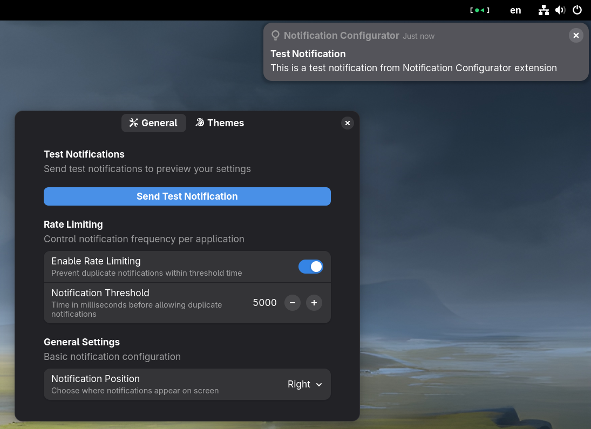

<h1 align="center">
	<br>
  GNOME Notification Configurator<br>
  
</h1>
<p align="center"><strong>Advanced GNOME notification capabilities including rate limiting, custom color theming per application, and notification positioning</strong></p>

<div align="center">

<a href="https://coff.ee/exposedcat" target="_blank"></a>

[](https://t.me/ExposedCatDev)
[](https://www.reddit.com/user/ExposedCatDev)

</div>

<br>

## Features

- **Global and Pattern-Based Rules** - Configure default behavior globally or
  create enabled/disabled per-pattern overrides matched by case-insensitive
  regular expressions for app name, title, and body text
- **Notification Filtering** - Hide or close matching notifications before they
  appear
- **Notification Rate Limiting** - Hide or close frequent notifications from the
  same application within a configurable time threshold
- **Notification Center Controls** - Disable stacking for matching
  notifications and set how many notifications are kept per source
- **Notification Timeout** - Configure auto-dismiss timing, keep notifications
  visible while idle, or set timeout to `0` to keep notifications until dismissed
- **Urgency Control** - Force notifications to normal urgency when needed
- **Window Attention Handling** - Activate attention-requesting windows instead
  of showing a notification
- **Fullscreen Notifications** - Enable or disable notifications while
  applications are running in fullscreen mode
- **Notification Positioning** - Set horizontal alignment (fill, left, center,
  right) and vertical alignment (fill, top, center, bottom)
- **Custom Appearance** - Hide the app title/time row, customize background,
  title, body, app name, and time colors, and adjust text sizes
- **Custom Margins** - Add top, bottom, left, and right notification margins
- **Test Notifications** - Send sample notifications from the preferences window
  to preview matching and styling changes

## Installation

### Extension Manager (Recommended)

- Install
  [Extension Manager](https://flathub.org/apps/com.mattjakeman.ExtensionManager)
- Search For `Notification Configurator` in `Browse` tab
- Select the extension and click `Install`

### GNOME Extenssions Website

<a href="https://extensions.gnome.org/extension/8249/notification-configurator/">
  <!-- Button SVG by Just Perfection developer -->
  
</a>

### Manual Installation

If latest version of the extension is not yet available on the GNOME Extensions
website, you can install it manually:

1. Clone this repository:
   ```bash
   git clone https://github.com/ExposedCat/gnome-notification-configurator.git
   cd gnome-notification-configurator
   ```

2. Install the extension:
   ```bash
   npm run install:local
   ```

   This will build the extension and install it to your local GNOME Shell
   extensions directory (`~/.local/share/gnome-shell/extensions/`).

3. Restart GNOME Shell:
   - Log out and log back in

4. Enable the extension:
   ```bash
   gnome-extensions enable notification-configurator@exposedcat
   ```

   Or use Extensions Manager app to enable "Notification Configurator".

## Development

### Development Workflow

1. **Setup development environment:**
   ```bash
   npm install
   ```

2. **Start development session:**
   ```bash
   npm start
   # Or in a container
   npm run start:container
   ```
   This will:
   - Compile TypeScript sources
   - Install to extensions directory
   - Launch nested GNOME Shell session for testing

3. **Debug the extension:**
   - Check terminal output for logs in the nested shell session
   - Access Looking Glass debugger with `Alt+F2` → `lg` for interactive
     debugging

## Translations

To add translations for the extension:

1. **Create a new translation file:**
   ```bash
   cp po/main.pot po/langcode.po
   ```
   Replace `langcode` with your language code (e.g., `po/uk.po` for Ukrainian).

2. **Edit the translation file:** Use
   [Gtranslator](https://flathub.org/apps/details/org.gnome.Gtranslator) or
   [POEdit](https://flathub.org/apps/details/net.poedit.Poedit) to edit the
   created file and make translations.

3. **Update translations when needed:** In case new labels were added or
   original labels changed, run:
   ```bash
   npm run translate
   ```
   Then update your translations if needed.

## License

This project is licensed under the GNU General Public License v3.0 or later
(GPL-3.0-or-later).

## Contributing

Contributions are welcome! Please feel free to submit pull requests or open
issues on the
[GitHub repository](https://github.com/ExposedCat/gnome-shell-notification-cleaner).
